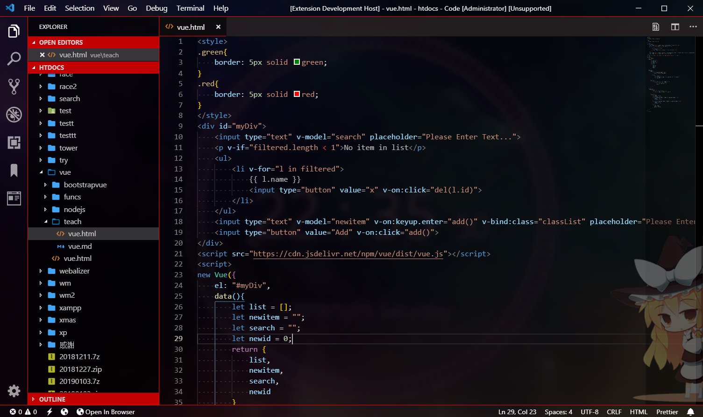

# Dark Red Theme
Dark red theme for vscode with transparency build support.  

## Links
- [Transparency vscode](https://github.com/microsoft/vscode/pull/52707)
- [Icons in screenshot](https://marketplace.visualstudio.com/items?itemName=emmanuelbeziat.vscode-great-icons)
- [Background anime picture in editor](https://marketplace.visualstudio.com/items?itemName=shalldie.background)
- [My custom vscode build](https://marketplace.visualstudio.com/items?itemName=shalldie.background)